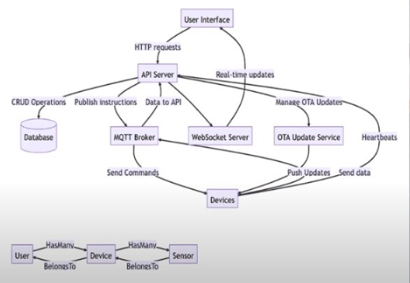

### Goal: Design a scalable IoT platform using Laravel for data collection, processing, and visualization.

## Key Considerations:

Device Connectivity: Securely handling various protocols (MQTT, LoRa, HTTP APIs, WebSockets, CoAP).
Real-time Processing: Efficiently processing incoming data.
Data Storage: Storing and retrieving large volumes of time-series data.
Data Visualization: Exposing data for visualization.
Security: Protecting data and devices.

### Proposed Architecture
1. Device Connectivity and Data Ingestion
   MQTT Broker: Use a scalable MQTT broker like Mosquitto or RabbitMQ to handle device connections and message queuing.
   Laravel Middleware: Create Laravel middleware to handle incoming MQTT messages or HTTP requests and validate device credentials.
   Data Ingestion Service: A Laravel service that listens to the MQTT broker or handles HTTP requests, parses data, and stores it in a queue for processing.
2. Real-time Data Processing
   Message Queue: Use a reliable message queue like Redis or RabbitMQ to process data asynchronously.
   Worker Processes: Run Laravel worker processes to consume messages from the queue and process data in parallel.
   Data Validation and Transformation: Validate incoming data, apply necessary transformations (e.g., normalization, aggregation), and enrich it with additional context.
3. Data Storage and Retrieval
   Relational Database: Consider using a relational database (e.g., MySQL, PostgreSQL) for metadata or related data that doesn't require time-series specific features.
   Time-Series Database: Use a time-series database like InfluxDB, TimescaleDB, or ClickHouse for efficient storage and querying of time-series data. if scale is a concern
   Data Modeling: Design a suitable data model for storing device data, sensor readings, and metadata.
4. Data Visualization
   RESTful API: Expose a RESTful API using Laravel's built-in routing and controllers to allow other applications to access and visualize the data.
5. Security
   Authentication and Authorization: Implement robust authentication mechanisms (e.g., OAuth, JWT) to protect the API.
   Data Encryption: Encrypt sensitive data both at rest and in transit.
   Device Authentication: Implement device authentication mechanisms to prevent unauthorized access.
   Security Best Practices: Follow security best practices, such as using strong passwords, regular updates, and vulnerability scanning.

